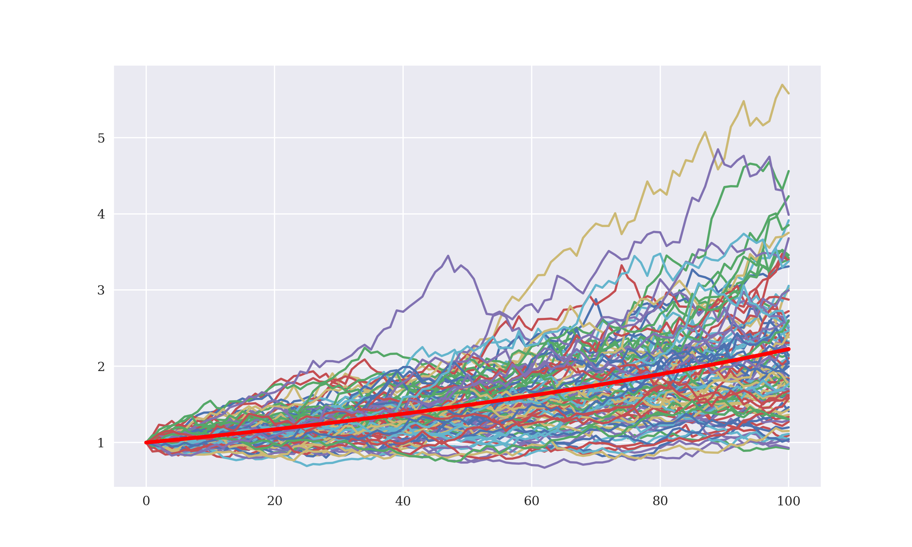
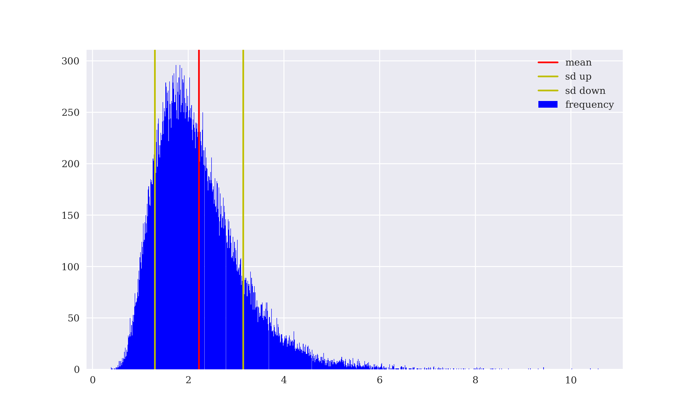

# Black Scholes Python Beispiele

[Mu = 0.8, sigma = 0.4 , wie im Wikipedia-Bsp.](https://de.wikipedia.org/wiki/Geometrische_brownsche_Bewegung#/media/Datei:Geometrische_Brownsche_Bewegung.png)

## Simulating the Stock Price Process
100 simulierte Pfade (Parameter I, verschiedene Farben) gegen den Erwartungswert (rot) geplottet.
Es sind 100 Diskretisierungsschritte (Paramater M, x-Achse). Beide Parameter I, M im Code beliebig wählbar.

## Verteilung / Histogramm der realisierten Werte
50000 simulierte Stichproben der geometrischen Verteilung (Zufallsprozesses zum Zeitpunkt T)

